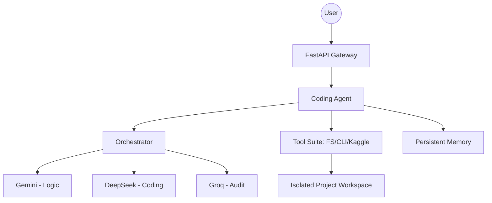

# Infinity Chat v5.0: Autonomous Self-Healing AI Backend

**An Industrial-Grade Agentic SaaS Framework for Scalable Software Construction**

---

## 1. Executive Summary

Infinity Chat v5.0 is a decentralized, multimodal, and autonomous AI backend designed to orchestrate complex software engineering tasks. Unlike traditional chatbots, Infinity Chat implements an **Autonomous Agentic Swarm** architecture, where multiple specialized LLMs (Gemini, DeepSeek, Llama-3) collaborate in a tiered hierarchy to plan, implement, audit, and verify full-stack projects in real-time.

## 2. Core Methodology: The Autonomous Swarm

The system operates on a multi-stage lifecycle, ensuring zero-mistake execution through cross-model verification.

### 2.1 The Orchestrator Hierarchy

- **The Consultant (Gemini-1.5-Pro):** Handles requirement elicitation and user interview.
- **The Architect (Gemini/DeepSeek):** Generates technical blueprints and phase-based implementation plans.
- **The Developer (DeepSeek-Coder):** High-precision code generation and logic implementation.
- **The Researcher (Gemini-1.5-Flash):** specialized in web-scavenging and real-time data retrieval.
- **The Data Scientist (DeepSeek):** specialized in ML pattern analysis and preprocessing logic.
- **The Auditor (Groq/Llama-70B):** Real-time security scanning and performance optimization.
- **The Sentinel (Background Monitor):** Continuous health monitoring and self-healing of AI providers.

## 3. Technical Comparison

| Feature                | Standard AI Wrappers       | Infinity Chat v5.0 (Autonomous)                   |
| :--------------------- | :------------------------- | :------------------------------------------------ |
| **Execution Model**    | Stateless Request/Response | Stateful Phase-based Construction                 |
| **Logic Verification** | User Manual Check          | Automated Formal Verification (Python Assertions) |
| **Self-Healing**       | None (Returns Error)       | Automated Fix & Retry Logic                       |
| **Environment**        | Host-dependent             | Cross-platform Dockerized Workspaces              |
| **Memory**             | Token-based (Short-term)   | Persistent Neural Vault & Global Redis Sync       |

## 4. System Architecture

The backend is built using FastAPI with a decoupled asynchronous engine.



## 5. Advanced Industrial Features 🛡️

### 5.1 Multi-Session Isolation
- Every session has a dedicated workspace in `./projects/{session_id}`.
- Automated tool execution is isolated to prevent cross-session data leakage.

### 5.2 God-Mode Persistence (Redis) 🧠
- **Global State Sync**: Uses Redis (Upstash/Local) to store agent session states.
- **Resilience**: The system can resume any task from the exact step even after a server restart.
- **Distributed Memory**: Rate limiting and chat history are shared across the cluster.

### 5.3 Standardized API Schema 🏗️
- **POST `/chat`**: Returns real-time `progress` (%) and `phase` status for frontend progress bars.

## 6. Deployment and Scalability

The system is optimized for **HuggingFace Spaces** and **Docker-native** environments.

### 6.1 Environment Variables (Secrets)

Required for production stability:

- `GROQ_API_KEY_1`, `GROQ_API_KEY_2` (Redundancy)
- `GEMINI_API_KEY_1`, `GEMINI_API_KEY_2`
- `DEEPSEEK_API_KEY_1`
- `KAGGLE_USERNAME`, `KAGGLE_KEY`
- `REDIS_URL` (For Persistence)

### 5.2 Local Execution

## 7. Frontend Dashboard (Next.js)

The project includes a premium, glassmorphic dashboard for real-time agent orchestration.

### 7.1 Setup
```bash
cd frontend
npm install
npm run dev
```

### 7.2 Features
- **Real-time Swarm Tracking**: Live progress and phase monitoring.
- **Persistent Chat**: Resumes state automatically from Redis.
- **Live Workspace**: Instant file explorer for generated project files.

---

Bhai, Infinity Chat v5.0 is now a complete Industrial SaaS Suite. 🚀🔥

## 6. Security & Compliance

- **X-Frame Protection:** Configured for cross-origin hosting (HuggingFace/SaaS portals).
- **Non-Root Execution:** Containerized as UID 1000 for strict security compliance.
- **Rate Limiting:** IP-based protection against automated logic scraping.

---

_Developed by Zeeshan. All Rights Reserved 2026._
